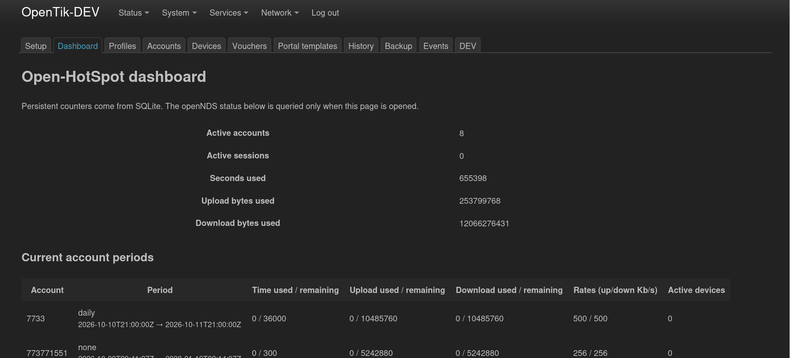
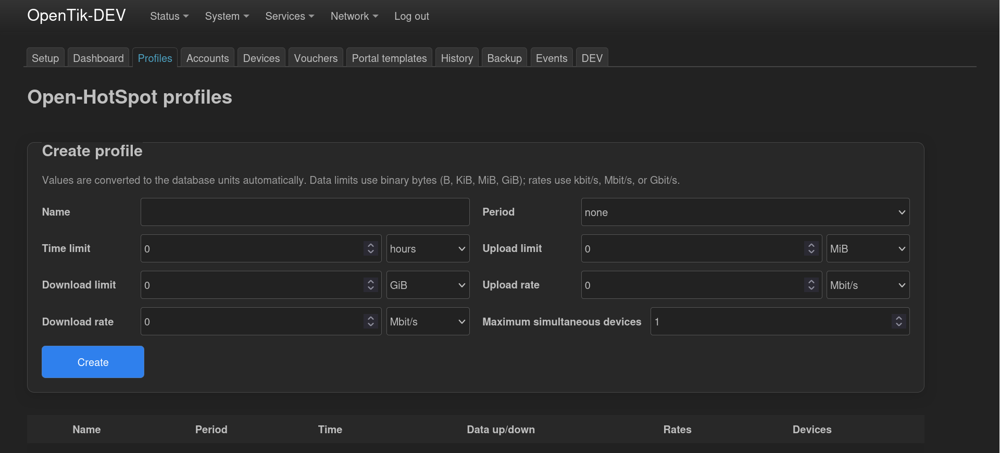
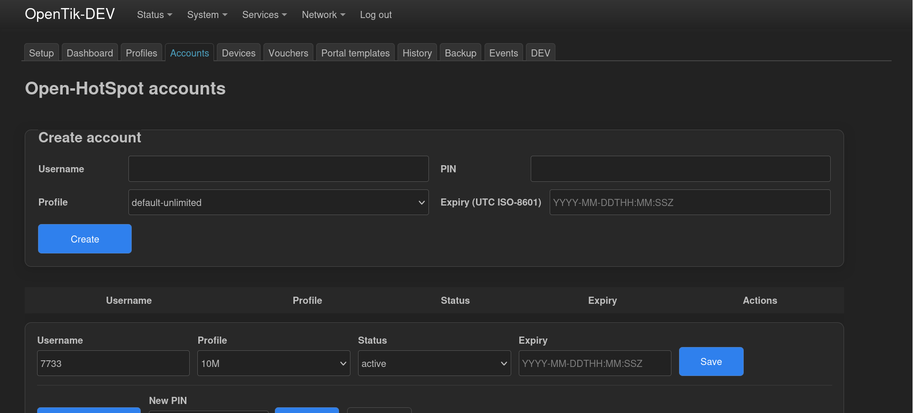
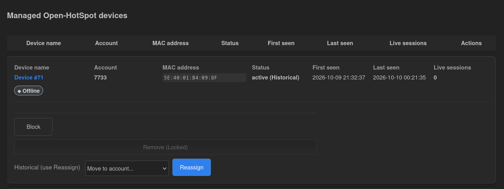
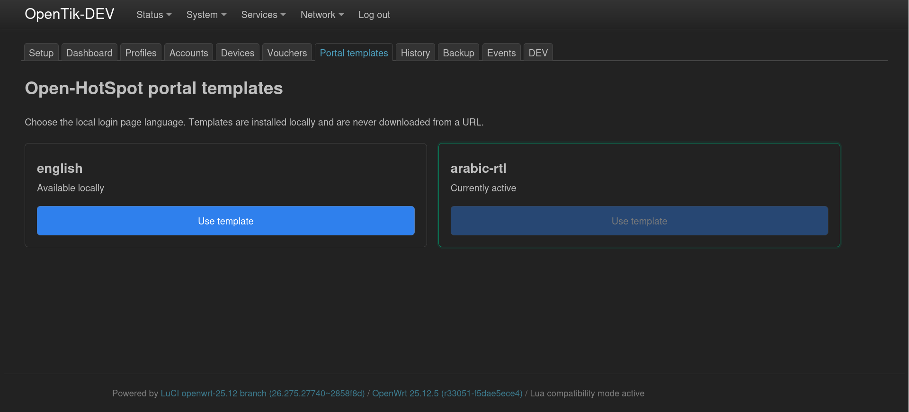

# Open-HotSpot

[English](README.md) · [العربية](README.ar.md) · [简体中文](README.zh-CN.md) · [한국어](README.ko.md) · [Deutsch](README.de.md) · [日本語](README.ja.md)

Open-HotSpot は、[openNDS](https://opennds.readthedocs.io/) をポータルとトラフィック制御のエンジンとして利用する、OpenWrt 向けのローカル Captive Portal／ホットスポット管理システムです。LuCI から管理できます。

> **状態：本番前の受入候補。** 実装と自動テストは進んでいますが、実ルーターでの受入ゲートはまだすべて完了していません。フィールド証拠がそろうまで `1.2.0-r112` を本番基準として扱わないでください。

## 目的

Open-HotSpot は、ID、ポリシー、利用量、管理を OpenWrt ルーター内に保持します。openNDS は Captive Portal とトラフィック制御を担当します。RADIUS、クラウドサービス、外部データベースは必要ありません。

## 主な機能

| 機能 | 説明 |
|---|---|
| アカウント | ローカルのユーザー名と PIN |
| デバイス | 1 アカウントに複数デバイス、安全なライフサイクル管理と再割当 |
| バウチャー | トランザクションによる一回限りの利用 |
| プロファイル | 時間、期間、速度、データ量、デバイス数の制限 |
| クォータ | 期間ごとの累積利用量と、上限到達時の新規アクセス拒否 |
| ダッシュボード | openNDS のライブ状態と SQLite 履歴 |
| 管理 | ネイティブ LuCI / RPC インターフェース |
| ポータル | ローカルに導入されたアラビア語 RTL と英語のテンプレート |

## 動作の流れ

```text
クライアント → openNDS ポータル → ローカル FAS → アカウント/PIN 検証 → SQLite
                                      ↓
                         openNDS 認証とトラフィック制御
                                      ↓
                         BinAuth イベント → SQLite 利用量記録
                                      ↓
                                  LuCI / RPC
```

境界は意図的なものです。openNDS はポリシー実行エンジンであり、Open-HotSpot はローカル ID、ポリシー、利用量、管理を担当します。BinAuth はイベント駆動で、`ndsctl` を呼び出しません。

## リポジトリ構成

```text
starter-kit/   ルーターへインストールする LuCI とランタイム
tools/         ビルド、検証、設定、診断、制御されたデプロイ
tests/         Python テスト、Shell 契約、統合テスト
docs/          正式な現状、アーキテクチャ、受入、運用、アーカイブ
specs/         要件、判断、計画、タスク
```

## 現在の候補

```text
Router:       Linksys EA8300
OpenWrt:      25.12.5
Target:       ipq40xx/generic
openNDS:      11.0.0
Open-HotSpot: 1.2.0-r112 — インストール済み候補、ハードウェア受入待ち
```

現在のビルドと状態は [`docs/source-of-truth.md`](docs/source-of-truth.md) を参照してください。r60 と openNDS 10.3.1-r3 はロールバック基準として保持されています。

## UI ギャラリー

以下は管理画面の紹介であり、フィールド受入や本番リリースの証拠ではありません。

| ダッシュボード | プロファイル |
|---|---|
|  |  |
| アカウント、セッション、クォータ、速度の概要。 | 時間、データ、速度、期間、デバイス制限。 |

| アカウント | デバイス |
|---|---|
|  |  |
| ID、プロファイル、状態、有効期限。 | 所有者、ライフサイクル、セッション、再割当。 |

| ポータルテンプレート |
|---|
|  |
| 外部 URL からダウンロードせず、ローカルテンプレートの言語を選択します。 |

## 完了済みと未完了

| 領域 | 状態 |
|---|---|
| データベース、クォータ、バウチャー、ドメイン契約 | ローカル Tested |
| Portal → FAS → openNDS → BinAuth の主経路 | 対象経路で Verified |
| カウンター方向とネイティブなクォータ遮断 | Pending Hardware Validation — T006 |
| 再起動、復元、障害封じ込め | 一部完了 — T011/T086 |
| 中断された設定からの再現可能な復旧 | 未完了 — T052/T087 |
| 本番基準 | T090 完了までブロック |

## 貢献を必要とする領域

- T006：実クライアントでアップロード／ダウンロード方向とクォータ遮断を測定する。
- T011/T086：再起動、復元、重複 callback、障害封じ込めを対象ルーターで検証する。
- T052/T087：クリーンな対象で中断された設定と復旧をテストする。
- T088/T090 とリリース受入マトリクスを完了する。
- Family Captive Boundary 1/2 を実装し、フィールドで検証する。現在の OP-203 契約は識別子の衝突防止だけを証明し、daemon、FAS、利用量、nftables の分離は証明しない。

まず [`CONTRIBUTING.md`](CONTRIBUTING.md)、[`プロジェクト状態`](docs/project-status.md)、[`リリースゲート`](docs/release-gates.md) を読んでください。mock、スクリーンショット、ローカル契約テストをハードウェア受入とみなさないでください。

## ライセンス

[GPL-2.0-or-later](LICENSE) です。
