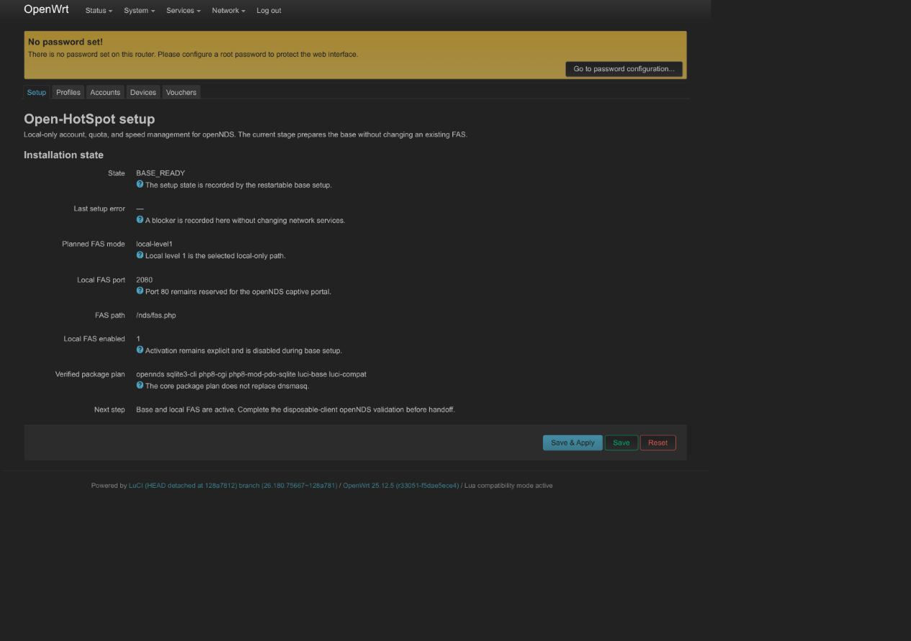
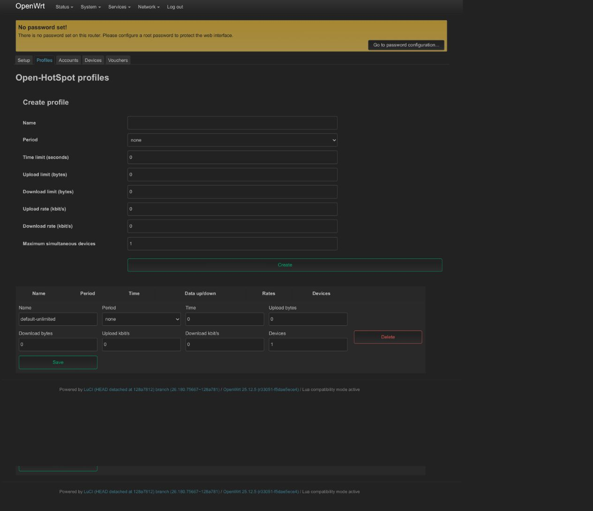
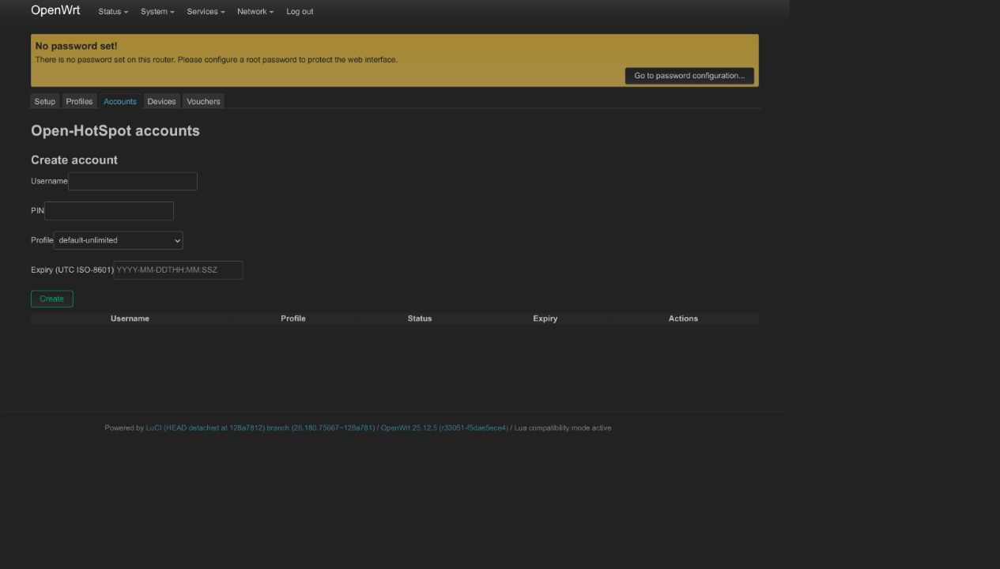
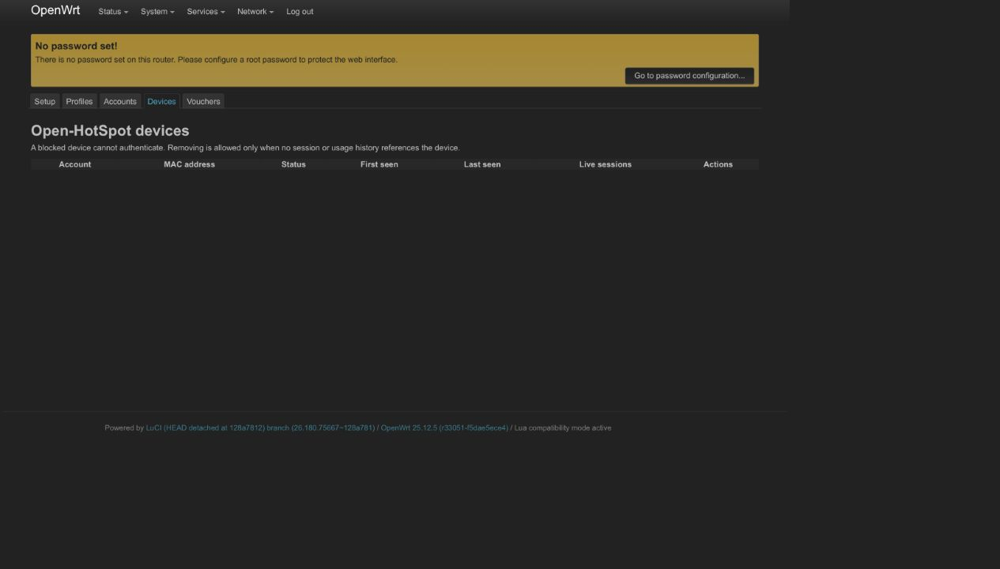
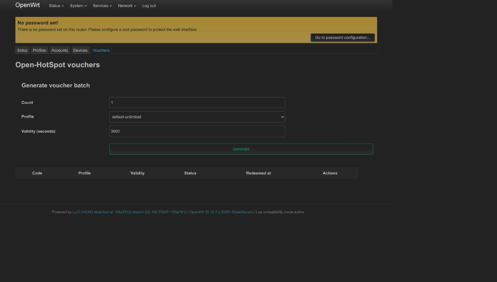

# Open-HotSpot — Spec-Kit Project (v1.2)

A LuCI management layer over **openNDS** for a single OpenWrt router:
accounts (with multiple devices each), quota/speed profiles, vouchers,
automatic cutoff, and a live dashboard — all local, SQLite-backed, no
RADIUS/external server. See `specs/001-open-hotspot/spec.md` for the full
specification.

## What changed from v1.0 (post architecture-review)
1. **Identity model fixed**: an Account is no longer a MAC address. It owns
   0..N `devices`, each with its own MAC, capped by `profiles.max_devices`.
2. **Local FAS flow is implemented and fail-closed**: `www/nds/fas.php`
   verifies username+PIN locally (PIN never reaches openNDS or a log), creates
   an opaque one-time transaction, and hands BinAuth a verified identity via
   the custom variable — `binauth.sh` no longer trusts a bare MAC to mean a
   specific account. The real-client authorization and accounting proof is
   still an open acceptance gate.
3. **Password hashing corrected**: PBKDF2-HMAC-SHA256 (`pbkdf2.sh`, via the
   verified PHP `hash_pbkdf2` API) is the only accepted credential scheme. If
   the target's `php8-cgi` KDF path is unavailable, setup fails closed.
4. **`db.sh`'s security claim corrected**: it does allow-list validation
   (`_valid_ident`/`_valid_mac`/`_valid_int`) + SQL-string escaping, not
   SQLite parameter binding — v1.0's comment overclaimed this.
5. **SC-006 (no double-counting) now has a mechanism, not just a test**: the
   `usage_events.event_key` unique constraint with `INSERT OR IGNORE` gates
   every usage accrual — covered by the domain contract tests (two identical
   callbacks accrue once).
6. **Vouchers added to v1** (batch-generate, self-service redemption),
   using the same DB-native concurrency pattern (`UPDATE ... WHERE
   status='unused'`) — also smoke-tested here.
7. **`cycle.sh` trimmed**; WAL checkpoint/log rotation/pruning moved to a
   separate once-daily `maintenance.sh` so the fast tick stays minimal.
8. **`init.d/open-hotspot` clarified**: it registers/deregisters cron
   entries and exits — it is not a persistent daemon.
9. **Period-boundary behavior made explicit** (FR-006): a live session is
   never force-disconnected purely for a calendar rollover; `cycle.sh`
   reissues an updated ceiling at the next tick instead.
10. Target-specific contracts are recorded, while the live-client gates remain
    explicit in `tasks.md`: counter direction (T006), restart/session restore
    (T011), the disposable end-to-end flow (T012), and final acceptance.

## Layout
Same spec-kit shape as before: `.specify/memory/constitution.md`,
`specs/001-open-hotspot/{spec,research,data-model,plan,quickstart,tasks}.md`,
and `starter-kit/` with a working schema + shell implementation of the
riskiest pieces (already smoke-tested for SQL-injection rejection and the
two concurrency guarantees — see commit history / test output).

## Physical-router checkpoint

The OpenWrt 25.12.5 SDK package was built as
`luci-app-open-hotspot 1.2.0-r60`; r60 is the current candidate package for the Linksys EA8300.
The local FAS listener is active on port `2080`; the exact
installation record, backup locations, SHA-256, rollback command, SDK/feed
procedure, and remaining live-client gates are in
[`specs/001-open-hotspot/quickstart.md`](specs/001-open-hotspot/quickstart.md).
The release decision and closure evidence for every remaining blocker are
tracked in [`docs/release-gates.md`](docs/release-gates.md).

The router's upstream can be Ethernet, Wi-Fi, or another DHCP source; its
address is not part of the local FAS contract. `dnsmasq-full` is installed with
nftset support on the recorded target. This closes the nftset capability gap,
but the target still has an independent openNDS startup/reload blocker
(`exit_code=139`) before r58. r58 applies the target-proven procd stdout
compatibility fix during install and upgrade. The package intentionally does not replace `dnsmasq` or
silently alter an existing FAS configuration.

The current APK is built by CI from source and attached to the matching GitHub
Release. Local `dist/` files are build outputs and are not release inputs.
The exact commit SHA and SHA-256 are recorded in the release assets and
acceptance matrix. See [`docs/release-policy.md`](docs/release-policy.md),
[`docs/release-acceptance-matrix.md`](docs/release-acceptance-matrix.md), and
[`docs/branch-protection.md`](.github/branch-protection.md) for the release
and repository-governance gates.

The preserved APK-by-APK ledger is in
[docs/release-history.md](docs/release-history.md).

Release r60 preserves the topology preflight, makes it directly executable,
discovers the LAN interface from UCI, waits for the target's observed startup
window, keeps the FAS firewall allowance idempotent, and checks openNDS
readiness during the Open-HotSpot init path when local FAS is enabled. It is
target-validated with local FAS enabled. r52 adds an address-independent
router-admin deny control for a dedicated client/IoT UCI network and documents
the WARP/captive-portal and isolated-SSID acceptance tests in
[`docs/router-access-and-iot.md`](docs/router-access-and-iot.md);
r53 removes the upgrade-time openNDS restart race and r54 waits for an
already-starting openNDS process before recovery; both add bounded runtime
r60 includes the dedicated-client lockout guard fail-closed behavior before touching
firewall state;
the preflight rejects duplicate local addresses,
an Open-HotSpot LAN equal to the default gateway, and LAN/WAN subnet overlap.
It also accepts the documented openNDS `hid` field and the
`client_hid` compatibility spelling observed in some captive-client flows.
Requests without a verified FAS payload remain rejected.

### Captive-portal URL contract

The built-in openNDS client-status page is available at
`http://status.client`; openNDS maintains this hostname as the current local
gateway alias at runtime. The custom Arabic/English login page is
served by the local FAS endpoint at `/nds/fas.php`, but it must be opened by
the openNDS captive-portal flow so that the documented FAS context is present.
Opening `/nds/fas.php` directly, or when a captive-client probe omits the FAS
payload, intentionally shows the styled “missing FAS data” page and does not
authenticate the client. Use the page's **Open portal** button or navigate to
`http://status.client` over plain HTTP, then submit the login form.

Local FAS activation intentionally leaves both `fasremoteip` and
`fasremotefqdn` unset. openNDS therefore derives the current gateway address
at runtime; changing the upstream router or WAN lease does not require a FAS
address edit. The client must connect to the Open-HotSpot router's managed
`br-lan`; a client connected only to upstream Wi-Fi bypasses openNDS.

The screenshot showing the “missing FAS data” card is therefore a captured
fail-closed diagnostic page, not evidence that the FAS page is absent from the
APK. The plain status page seen during the field test was captured while
openNDS was in a startup loop; after r51 recovery, its CSS/image paths and the
CPD-to-FAS redirect were verified. The package post-install also runs the base
setup boundary on fresh installs and upgrades. Explicit FAS activation generates
a random local key if the factory router has none; the key is never printed or
committed. The remaining physical-router gate is a
successful disposable-client session: portal → FAS login → openNDS
`Authenticated` state.

## Distribution

The OpenWrt APK is not a GitHub Packages format. GitHub Packages currently
supports npm, RubyGems, Maven/Gradle, NuGet, Docker, and OCI registries, so the
repository's Packages page correctly remains empty. The APK is distributed as
a repository artifact and, when a `v*` tag is pushed, the included workflow
publishes it as a GitHub Release asset. See [Releases](https://github.com/opentik-dev/open-hotspot/releases).

## LuCI screenshots

These screenshots were captured from the installed package on the test router.
The yellow banner is intentional: the router still needs a root password before
handoff.











## Continue with the real spec-kit CLI
```bash
uv tool install specify-cli --from git+https://github.com/github/spec-kit.git
cd open-hotspot
specify init --here --integration claude
```
Then, in order: `/speckit.plan` → `/speckit.tasks` → `/speckit.analyze` →
`/speckit.implement`. Close the remaining target gates T003, T006, T011, T012,
T052, and T086–T088 before declaring the package a production release.
